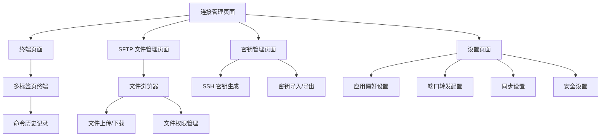

# termTool 产品需求文档

## 1. 产品概述

termTool 是一款跨平台（macOS 和 Windows）的 SSH/SFTP 管理工具，提供安全、高效的远程服务器管理体验。产品面向开发人员、系统管理员和运维工程师，解决多服务器连接管理繁琐、文件传输不便、终端体验不佳等问题，通过统一的界面和加密存储机制，帮助用户快速、安全地管理远程服务器。

## 2. 核心功能

### 2.1 用户角色

| 角色   | 注册方式     | 核心权限                                          |
| ---- | -------- | --------------------------------------------- |
| 标准用户 | 本地安装即可使用 | 可以创建、编辑、删除 SSH 连接配置，使用 SFTP 文件传输，终端连接，端口转发等功能 |

### 2.2 功能模块

termTool 需求包含以下主要页面：

1. **连接管理页面**：连接列表、添加/编辑连接、连接分组管理、搜索和快速连接
2. **终端页面**：多标签页终端、ANSI 颜色支持、命令历史记录
3. **SFTP 文件管理页面**：文件浏览器、文件上传/下载、目录操作、文件权限管理
4. **密钥管理页面**：SSH 密钥生成、导入、导出、密钥绑定
5. **设置页面**：应用偏好设置、端口转发配置、同步设置、安全设置

### 2.3 页面详情

| 页面名称        | 模块名称      | 功能描述                                         |
| ----------- | --------- | -------------------------------------------- |
| 连接管理页面      | 连接列表      | 显示所有保存的 SSH 连接配置，支持分组显示、排序、状态指示              |
|        | 添加/编辑连接   | 创建新连接或编辑现有连接，包括主机名、端口、用户名、认证方式（密码/密钥）、连接标签   |
|        | 连接分组      | 创建、编辑、删除连接分组，支持拖拽分组管理                        |
|        | 搜索和快速连接   | 实时搜索连接配置，支持快捷键快速打开连接                         |
| 终端页面        | 多标签页终端    | 支持同时打开多个终端标签页，标签页切换、关闭、拖拽排序                  |
|        | ANSI 颜色支持 | 完整支持 ANSI 转义序列和颜色代码，提供真实的终端体验                |
|        | 命令历史记录    | 自动记录执行的命令，支持历史命令搜索和重复执行                      |
|        | 终端配置      | 自定义终端字体、字号、颜色主题、光标样式                         |
| SFTP 文件管理页面 | 文件浏览器     | 双面板文件浏览器，显示本地和远程文件系统                         |
|        | 文件上传/下载   | 支持文件和目录的上传下载，支持断点续传、队列管理                     |
|        | 目录操作      | 创建、删除、重命名目录，查看目录属性                           |
|        | 文件权限管理    | 查看和修改文件权限，支持 chmod 命令                        |
|        | 文件编辑      | 直接在远程服务器上编辑文本文件                              |
| 密钥管理页面      | SSH 密钥生成  | 生成新的 SSH 密钥对（RSA、ED25519、ECDSA），支持自定义密钥长度和注释 |
|        | 密钥导入      | 导入已有的私钥文件，支持 PEM、PKCS8 等格式                   |
|        | 密钥导出      | 导出公钥和私钥，支持复制到剪贴板或保存到文件                       |
|        | 密钥绑定      | 将密钥绑定到特定的连接配置，简化连接过程                         |
| 设置页面        | 应用偏好设置    | 界面主题、语言、字体设置、启动选项                            |
|        | 端口转发配置    | 配置本地端口转发、远程端口转发、动态端口转发（SOCKS 代理）             |
|        | 同步设置      | 配置本地加密存储，设置同步路径，数据备份和恢复                      |
|        | 安全设置      | 设置主密码、自动锁定时间、剪贴板清理、会话超时                      |

## 3. 核心流程

### 3.1 用户操作流程

**新建 SSH 连接流程**

1. 用户打开连接管理页面
2. 点击"添加连接"按钮
3. 填写连接信息（主机名、端口、用户名）
4. 选择认证方式（密码或 SSH 密钥）
5. 选择连接分组（可选）
6. 点击"保存"按钮
7. 系统加密保存连接配置
8. 在连接列表中显示新连接

**建立 SSH 连接流程**

1. 用户在连接列表中选择目标连接
2. 点击"连接"按钮或使用快捷键
3. 系统验证主机指纹（首次连接时）
4. 用户确认主机指纹
5. 系统建立 SSH 连接
6. 打开终端标签页显示远程服务器 Shell
7. 可同时打开多个终端标签页

**SFTP 文件传输流程**

1. 用户建立 SSH 连接后，点击"SFTP"按钮
2. 系统打开 SFTP 文件管理页面
3. 显示本地文件面板（左侧）和远程文件面板（右侧）
4. 用户选择文件或目录
5. 点击上传或下载按钮
6. 系统显示传输进度和状态
7. 传输完成后显示成功提示

**端口转发配置流程**

1. 用户在设置页面选择"端口转发"
2. 点击"添加转发规则"
3. 选择转发类型（本地/远程/动态）
4. 配置本地端口、远程主机和端口
5. 保存规则
6. 在连接时自动应用端口转发规则

### 3.2 页面导航流程图

## 4. 用户界面设计

### 4.1 设计风格

* **主色调**：深色主题为主，主色使用 #1E1E1E（深灰背景）、#007ACC（蓝色强调色）

* **辅助色**：#4EC9B0（青色）、#CE9178（橙色）、#D7BA7D（黄色）用于不同状态标识

* **按钮风格**：扁平化设计，圆角 4px，悬停时显示微弱阴影和背景色变化

* **字体**：等宽字体用于终端显示（推荐 JetBrains Mono、Fira Code），UI 使用系统字体（San Francisco、Segoe UI）

* **布局**：左侧导航栏 + 主内容区域的经典布局，连接列表采用卡片式设计

* **图标风格**：线性图标，使用 Feather Icons 或 Heroicons 风格，保持简洁统一

### 4.2 页面设计概述

| 页面名称        | 模块名称    | UI 元素                                                                      |
| ----------- | ------- | -------------------------------------------------------------------------- |
| 连接管理页面      | 连接列表    | 卡片式布局，每个连接卡片显示主机名、用户名、连接状态图标、分组标签，支持悬停效果和点击选中状态，使用 #2D2D2D 背景色，#404040 边框色 |
|        | 添加/编辑连接 | 模态对话框设计，表单布局，输入框使用 #1E1E1E 背景，白色文字，蓝色聚焦边框，保存和取消按钮位于底部右侧                    |
|        | 搜索框     | 顶部固定搜索栏，实时过滤显示结果，支持快捷键 Ctrl/Cmd + K 快速聚焦                                   |
| 终端页面        | 多标签页    | 顶部标签栏，标签显示主机名和连接状态，活动标签使用蓝色高亮，支持标签拖拽排序和右键菜单                                |
|        | 终端区域    | 全屏终端显示区域，黑色背景 #000000，支持自定义字体大小和颜色主题，底部显示连接状态和快捷键提示                        |
| SFTP 文件管理页面 | 文件浏览器   | 双面板分割布局，左右各占 50%，面包屑导航栏，文件图标根据类型显示（文件夹、文本文件、可执行文件），选中项使用蓝色高亮               |
|        | 传输进度    | 底部显示传输队列和进度条，使用绿色表示完成，黄色表示进行中，红色表示失败                                       |
| 密钥管理页面      | 密钥列表    | 列表视图显示所有密钥，每项显示密钥名称、类型、指纹、绑定连接数，支持右键菜单操作                                   |
| 设置页面        | 设置面板    | 侧边栏导航 + 内容区域，使用分组卡片设计，每个设置组有清晰的标题和说明文字                                     |

### 4.3 响应性

* **桌面优先**：主要针对桌面端（macOS 和 Windows）优化，充分利用屏幕空间

* **窗口适配**：支持窗口大小调整，最小尺寸 1024x768 像素，界面元素自适应布局

* **高 DPI 支持**：针对 Retina 和高 DPI 显示屏优化，确保文字和图标清晰锐利

* **键盘导航**：完整支持键盘快捷键和 Tab 键导航，提高操作效率

## 5. 非功能性需求

### 5.1 性能要求

* **连接速度**：SSH 连接建立时间应在 3 秒内完成（在网络条件良好的情况下）

* **文件传输**：SFTP 文件传输速度应达到网络带宽的 90% 以上

* **启动时间**：应用启动时间应控制在 2 秒内（不包含连接初始化）

* **内存占用**：应用在空闲状态下内存占用应低于 150MB

* **响应时间**：UI 操作响应时间应小于 100ms，终端输入响应时间小于 50ms

### 5.2 安全要求

* **数据加密**：所有连接配置和 SSH 密钥必须使用 AES-256 加密存储

* **密码保护**：支持设置主密码，启动应用时需要输入主密码才能访问敏感数据

* **主机指纹验证**：首次连接时必须验证主机指纹，指纹变更时发出警告

* **会话管理**：支持自动锁定和会话超时，防止未授权访问

* **剪贴板清理**：可选自动清理剪贴板中的敏感信息（密码、密钥）

* **安全传输**：所有网络传输使用 SSH 协议加密，支持 SSH-2 协议

* **密钥安全**：私钥文件权限严格限制，支持密码保护的私钥

### 5.3 可扩展性

* **插件架构**：预留插件接口，支持第三方扩展功能

* **主题系统**：支持自定义主题和配色方案

* **配置迁移**：支持从其他 SSH 客户端（如 Termius、PuTTY）导入配置

* **多语言支持**：架构支持国际化，优先支持中文和英文

* **协议扩展**：预留其他远程协议（如 Telnet、RDP）的扩展接口

### 5.4 可用性要求

* **错误处理**：提供友好的错误提示和解决方案，避免技术术语

* **操作撤销**：支持关键操作的撤销功能（如删除连接）

* **快捷键**：提供丰富的快捷键支持，并在界面中显示快捷键提示

* **帮助文档**：内置帮助文档和快捷操作指南

* **用户反馈**：提供用户反馈和问题报告渠道

### 5.5 兼容性要求

* **操作系统**：支持 macOS 10.15+ 和 Windows 10+

* **SSH 协议**：支持 SSH-2 协议，兼容 OpenSSH 6.5+

* **终端模拟**：兼容 xterm-256color 和 VT100 终端标准

* **文件系统**：支持常见的文件系统格式（EXT4、NTFS、APFS 等）

* **字符编码**：支持 UTF-8 编码，正确显示多语言字符

## 6. 技术栈建议

### 6.1 跨平台框架

* **推荐**：Electron + React/Vue

  * 优势：成熟的跨平台解决方案，丰富的生态系统，快速开发周期

  * 适用场景：需要快速迭代，团队熟悉 Web 技术栈

* **备选**：Tauri + React/Vue

  * 优势：更小的安装包体积，更好的性能，更安全的架构

  * 适用场景：对性能和安装包大小有较高要求

* **备选**：Flutter

  * 优势：优秀的性能和一致的用户体验，丰富的组件库

  * 适用场景：需要高度定制化的 UI 和动画效果

### 6.2 核心依赖库

* **SSH 客户端**：node-ssh (Node.js)、ssh2-sftp-client (SFTP)

* **终端模拟器**：xterm.js（终端渲染和交互）

* **加密存储**：electron-store（配置存储）、crypto-js（数据加密）

* **UI 框架**：React + Ant Design / Vue + Element Plus

* **状态管理**：Redux / Pinia

* **构建工具**：Vite / Webpack

### 6.3 开发工具

* **版本控制**：Git

* **代码规范**：ESLint + Prettier

* **测试框架**：Jest + Playwright（E2E 测试）

* **CI/CD**：GitHub Actions / GitLab CI

### 6.4 打包和分发

* **macOS**：生成 .dmg 安装包，支持代码签名和公证

* **Windows**：生成 .exe 安装包和便携版

* **自动更新**：electron-updater / tauri-updater

