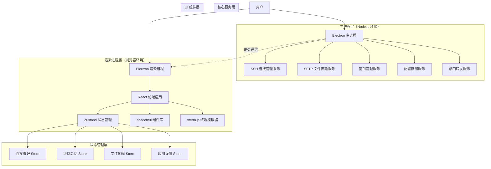

# termTool 技术架构文档

## 1. 架构设计

### 1.1 整体架构图



### 1.2 分层架构说明

**主进程层（Main Process）**
- 负责应用生命周期管理
- 处理原生系统 API 调用
- 管理 SSH/SFTP 连接
- 处理文件系统操作
- 数据加密存储
- IPC 通信协调

**渲染进程层（Renderer Process）**
- React 应用 UI 渲染
- 用户交互处理
- 状态管理（Zustand）
- 组件渲染和更新
- 终端界面展示

**通信机制**
- 使用 Electron IPC（Inter-Process Communication）进行进程间通信
- 主进程暴露预加载脚本（Preload）给渲染进程安全的 API
- 采用事件驱动模式进行异步通信

## 2. 技术选型

### 2.1 前端技术栈

| 技术 | 版本 | 用途说明 |
|------|------|---------|
| React | 18.3+ | UI 框架，构建响应式用户界面 |
| TypeScript | 5.3+ | 类型安全，提高代码质量 |
| Vite | 5.0+ | 构建工具，快速开发和打包 |
| Zustand | 4.4+ | 状态管理，轻量级状态管理方案 |
| Tailwind CSS | 3.4+ | 样式框架，原子化 CSS |
| shadcn/ui | 最新 | UI 组件库，提供高质量组件 |
| xterm.js | 5.3+ | 终端模拟器，提供终端渲染和交互 |
| React Router | 6.20+ | 路由管理，页面导航 |

### 2.2 后端技术栈（主进程）

| 技术 | 版本 | 用途说明 |
|------|------|---------|
| Electron | 28.0+ | 跨平台应用框架 |
| node-ssh | 13.1+ | SSH 客户端，建立 SSH 连接 |
| ssh2-sftp-client | 9.1+ | SFTP 客户端，文件传输 |
| electron-store | 8.1+ | 本地配置存储 |
| crypto-js | 4.2+ | 数据加密，保护敏感信息 |

### 2.3 开发工具链

| 工具 | 用途说明 |
|------|---------|
| ESLint + TypeScript ESLint | 代码质量检查 |
| Prettier | 代码格式化 |
| Husky + lint-staged | Git 钩子，提交前检查 |
| electron-builder | 应用打包和分发 |
| electron-updater | 自动更新机制 |
| Vitest | 单元测试 |
| Playwright | E2E 测试 |

## 3. 目录结构设计

```
termTool/
├── .trae/                      # 项目文档
│   └── documents/              # 文档目录
├── src/
│   ├── main/                   # 主进程代码
│   │   ├── index.ts           # 主进程入口
│   │   ├── ipc/               # IPC 通信处理
│   │   │   ├── handlers/      # IPC 事件处理器
│   │   │   │   ├── connection.ts      # 连接相关 IPC
│   │   │   │   ├── terminal.ts        # 终端相关 IPC
│   │   │   │   ├── sftp.ts            # SFTP 相关 IPC
│   │   │   │   ├── key.ts             # 密钥相关 IPC
│   │   │   │   └── settings.ts        # 设置相关 IPC
│   │   │   └── channels.ts     # IPC 通道定义
│   │   ├── services/          # 业务服务层
│   │   │   ├── SSHConnectionService.ts    # SSH 连接服务
│   │   │   ├── SFTPService.ts             # SFTP 文件传输服务
│   │   │   ├── KeyManagerService.ts       # 密钥管理服务
│   │   │   ├── StorageService.ts          # 存储服务
│   │   │   ├── PortForwardingService.ts   # 端口转发服务
│   │   │   └── EncryptionService.ts      # 加密服务
│   │   ├── models/            # 数据模型
│   │   │   ├── Connection.ts              # 连接模型
│   │   │   ├── SSHKey.ts                  # 密钥模型
│   │   │   ├── TerminalSession.ts         # 终端会话模型
│   │   │   ├── FileTransfer.ts            # 文件传输模型
│   │   │   └── PortForwarding.ts          # 端口转发模型
│   │   ├── utils/             # 工具函数
│   │   │   ├── logger.ts                  # 日志工具
│   │   │   ├── validator.ts               # 数据验证
│   │   │   └── constants.ts               # 常量定义
│   │   └── preload.ts         # 预加载脚本
│   │
│   ├── renderer/               # 渲染进程代码
│   │   ├── main.tsx          # 渲染进程入口
│   │   ├── App.tsx           # 根组件
│   │   ├── pages/            # 页面组件
│   │   │   ├── ConnectionPage.tsx         # 连接管理页面
│   │   │   ├── TerminalPage.tsx           # 终端页面
│   │   │   ├── SFTPPage.tsx               # SFTP 页面
│   │   │   ├── KeyManagerPage.tsx         # 密钥管理页面
│   │   │   └── SettingsPage.tsx           # 设置页面
│   │   ├── components/       # 公共组件
│   │   │   ├── ui/                       # shadcn/ui 组件
│   │   │   ├── ConnectionCard.tsx        # 连接卡片
│   │   │   ├── TerminalTab.tsx           # 终端标签
│   │   │   ├── FileBrowser.tsx           # 文件浏览器
│   │   │   ├── KeyList.tsx               # 密钥列表
│   │   │   └── Dialog.tsx                # 对话框
│   │   ├── stores/           # Zustand 状态管理
│   │   │   ├── connectionStore.ts        # 连接状态
│   │   │   ├── terminalStore.ts          # 终端状态
│   │   │   ├── sftpStore.ts              # SFTP 状态
│   │   │   ├── keyStore.ts               # 密钥状态
│   │   │   └── settingsStore.ts          # 设置状态
│   │   ├── hooks/            # 自定义 Hooks
│   │   │   ├── useTerminal.ts            # 终端 Hook
│   │   │   ├── useSFTP.ts                # SFTP Hook
│   │   │   ├── useEncryption.ts          # 加密 Hook
│   │   │   └── useIPC.ts                 # IPC 通信 Hook
│   │   ├── types/            # TypeScript 类型定义
│   │   │   ├── connection.types.ts       # 连接类型
│   │   │   ├── terminal.types.ts         # 终端类型
│   │   │   ├── sftp.types.ts             # SFTP 类型
│   │   │   └── common.types.ts           # 通用类型
│   │   ├── utils/            # 工具函数
│   │   │   ├── formatters.ts             # 格式化工具
│   │   │   ├── validators.ts             # 验证工具
│   │   │   └── helpers.ts                # 辅助函数
│   │   └── styles/           # 样式文件
│   │       └── globals.css               # 全局样式
│   │
│   └── shared/                 # 共享代码
│       ├── constants/       # 共享常量
│       │   ├── app.ts                    # 应用常量
│       │   └── ipc.ts                    # IPC 通道常量
│       └── types/           # 共享类型
│           ├── ipc.ts                    # IPC 类型
│           └── models.ts                 # 共享模型类型
│
├── resources/                # 资源文件
│   ├── icons/              # 应用图标
│   └── assets/             # 静态资源
│
├── tests/                    # 测试文件
│   ├── unit/               # 单元测试
│   ├── integration/        # 集成测试
│   └── e2e/                # E2E 测试
│
├── .eslintrc.js            # ESLint 配置
├── .prettierrc             # Prettier 配置
├── tsconfig.json           # TypeScript 配置
├── vite.config.ts          # Vite 配置
├── electron-builder.yml    # 打包配置
├── package.json            # 项目依赖
└── README.md               # 项目说明
```

## 4. 核心模块设计

### 4.1 SSH 连接管理模块

**职责**：管理 SSH 连接的生命周期，包括连接建立、维护、断开等。

**核心类**：
```typescript
// src/main/services/SSHConnectionService.ts
class SSHConnectionService {
  // 创建 SSH 连接
  async createConnection(config: ConnectionConfig): Promise<SSHConnection>;
  
  // 断开连接
  async disconnect(connectionId: string): Promise<void>;
  
  // 获取连接状态
  getConnectionStatus(connectionId: string): ConnectionStatus;
  
  // 验证主机指纹
  async verifyHostFingerprint(host: string, port: number): Promise<string>;
  
  // 执行命令
  async executeCommand(connectionId: string, command: string): Promise<CommandResult>;
}
```

**数据流**：
1. 用户在 UI 中输入连接信息
2. 渲染进程通过 IPC 发送到主进程
3. 主进程创建 SSH 连接
4. 返回连接状态给渲染进程
5. 渲染进程更新 UI 状态

### 4.2 SFTP 文件传输模块

**职责**：处理文件和目录的上传、下载、删除等操作。

**核心类**：
```typescript
// src/main/services/SFTPService.ts
class SFTPService {
  // 初始化 SFTP 连接
  async initSFTP(connectionId: string): Promise<void>;
  
  // 列出目录内容
  async listDirectory(path: string): Promise<FileInfo[]>;
  
  // 上传文件
  async uploadFile(localPath: string, remotePath: string, onProgress: ProgressCallback): Promise<void>;
  
  // 下载文件
  async downloadFile(remotePath: string, localPath: string, onProgress: ProgressCallback): Promise<void>;
  
  // 删除文件
  async deleteFile(path: string): Promise<void>;
  
  // 修改文件权限
  async chmod(path: string, mode: number): Promise<void>;
}
```

**传输队列管理**：
- 支持并发传输，最大并发数可配置
- 提供传输进度实时更新
- 支持断点续传
- 传输失败自动重试

### 4.3 终端模拟模块

**职责**：提供真实的终端体验，支持 ANSI 颜色、多标签页等。

**核心类**：
```typescript
// src/renderer/components/Terminal.tsx
interface TerminalProps {
  connectionId: string;
  onDisconnect: () => void;
}

class TerminalManager {
  // 创建终端实例
  createTerminal(container: HTMLElement, connectionId: string): Terminal;
  
  // 写入数据到终端
  writeData(terminalId: string, data: string): void;
  
  // 调整终端大小
  resize(terminalId: string, cols: number, rows: number): void;
  
  // 销毁终端
  destroyTerminal(terminalId: string): void;
}
```

**功能特性**：
- 完整支持 ANSI 转义序列
- 支持自定义颜色主题
- 支持复制、粘贴操作
- 支持快捷键绑定
- 支持命令历史记录

### 4.4 密钥管理模块

**职责**：管理 SSH 密钥的生成、导入、导出和存储。

**核心类**：
```typescript
// src/main/services/KeyManagerService.ts
class KeyManagerService {
  // 生成新的密钥对
  async generateKeyPair(type: KeyType, bits?: number, comment?: string): Promise<SSHKeyPair>;
  
  // 导入私钥
  async importPrivateKey(filePath: string, passphrase?: string): Promise<SSHKey>;
  
  // 导出公钥
  async exportPublicKey(keyId: string): Promise<string>;
  
  // 删除密钥
  async deleteKey(keyId: string): Promise<void>;
  
  // 验证密钥
  async validateKey(keyId: string): Promise<boolean>;
}
```

**支持的密钥类型**：
- RSA（2048、4096 位）
- ED25519
- ECDSA（P256、P384、P521）

### 4.5 配置存储模块

**职责**：管理应用配置的加密存储和读取。

**核心类**：
```typescript
// src/main/services/StorageService.ts
class StorageService {
  // 保存连接配置
  async saveConnection(config: ConnectionConfig): Promise<void>;
  
  // 获取所有连接
  async getAllConnections(): Promise<ConnectionConfig[]>;
  
  // 删除连接
  async deleteConnection(id: string): Promise<void>;
  
  // 保存应用设置
  async saveSettings(settings: AppSettings): Promise<void>;
  
  // 获取应用设置
  async getSettings(): Promise<AppSettings>;
}
```

**存储格式**：
```typescript
// 加密存储的数据结构
interface EncryptedData {
  encrypted: string;  // AES-256 加密的数据
  iv: string;         // 初始化向量
  authTag: string;    // 认证标签
}
```

### 4.6 端口转发模块

**职责**：管理本地端口转发、远程端口转发和动态端口转发（SOCKS 代理）。

**核心类**：
```typescript
// src/main/services/PortForwardingService.ts
class PortForwardingService {
  // 创建本地端口转发
  async createLocalForwarding(config: LocalForwardingConfig): Promise<string>;
  
  // 创建远程端口转发
  async createRemoteForwarding(config: RemoteForwardingConfig): Promise<string>;
  
  // 创建动态端口转发（SOCKS）
  async createDynamicForwarding(config: DynamicForwardingConfig): Promise<string>;
  
  // 停止端口转发
  async stopForwarding(forwardingId: string): Promise<void>;
  
  // 获取转发状态
  getForwardingStatus(forwardingId: string): ForwardingStatus;
}
```

## 5. 数据模型设计

### 5.1 连接模型

```typescript
// src/main/models/Connection.ts
interface ConnectionConfig {
  id: string;                    // 唯一标识符
  name: string;                  // 连接名称
  host: string;                  // 主机地址
  port: number;                  // 端口号（默认 22）
  username: string;              // 用户名
  authMethod: AuthMethod;        // 认证方式：password | key
  password?: string;             // 密码（加密存储）
  keyId?: string;                // 绑定的密钥 ID
  keyPassphrase?: string;        // 密钥密码（加密存储）
  groupId?: string;              // 所属分组 ID
  tags: string[];                // 标签
  notes?: string;                // 备注
  hostFingerprint?: string;       // 主机指纹
  portForwarding?: PortForwardingConfig[];  // 端口转发配置
  createdAt: Date;               // 创建时间
  updatedAt: Date;               // 更新时间
}

enum AuthMethod {
  Password = 'password',
  Key = 'key'
}
```

### 5.2 密钥模型

```typescript
// src/main/models/SSHKey.ts
interface SSHKey {
  id: string;                    // 唯一标识符
  name: string;                  // 密钥名称
  type: KeyType;                 // 密钥类型
  publicKey: string;             // 公钥
  privateKey: string;            // 私钥（加密存储）
  passphrase?: string;           // 密钥密码（加密存储）
  fingerprint: string;           // 密钥指纹
  comment?: string;              // 注释
  createdAt: Date;               // 创建时间
  lastUsed?: Date;               // 最后使用时间
}

enum KeyType {
  RSA = 'rsa',
  ED25519 = 'ed25519',
  ECDSA = 'ecdsa'
}

interface SSHKeyPair {
  publicKey: string;
  privateKey: string;
  fingerprint: string;
}
```

### 5.3 终端会话模型

```typescript
// src/main/models/TerminalSession.ts
interface TerminalSession {
  id: string;                    // 会话 ID
  connectionId: string;          // 关联的连接 ID
  name: string;                  // 会话名称（通常是主机名）
  status: SessionStatus;         // 会话状态
  cols: number;                  // 终端列数
  rows: number;                  // 终端行数
  commandHistory: string[];      // 命令历史
  createdAt: Date;               // 创建时间
  lastActive: Date;              // 最后活动时间
}

enum SessionStatus {
  Connecting = 'connecting',
  Connected = 'connected',
  Disconnected = 'disconnected',
  Error = 'error'
}
```

### 5.4 文件传输模型

```typescript
// src/main/models/FileTransfer.ts
interface FileTransfer {
  id: string;                    // 传输 ID
  type: TransferType;           // 传输类型
  localPath: string;             // 本地路径
  remotePath: string;            // 远程路径
  size: number;                  // 文件大小
  transferred: number;           // 已传输字节数
  status: TransferStatus;        // 传输状态
  speed: number;                 // 传输速度（字节/秒）
  error?: string;                // 错误信息
  createdAt: Date;               // 创建时间
  completedAt?: Date;            // 完成时间
}

enum TransferType {
  Upload = 'upload',
  Download = 'download'
}

enum TransferStatus {
  Pending = 'pending',
  Transferring = 'transferring',
  Paused = 'paused',
  Completed = 'completed',
  Failed = 'failed',
  Cancelled = 'cancelled'
}
```

### 5.5 端口转发模型

```typescript
// src/main/models/PortForwarding.ts
interface PortForwardingConfig {
  id: string;                    // 转发 ID
  type: ForwardingType;          // 转发类型
  localHost: string;             // 本地主机
  localPort: number;             // 本地端口
  remoteHost: string;            // 远程主机
  remotePort: number;            // 远程端口
  enabled: boolean;              // 是否启用
  autoConnect: boolean;          // 是否自动连接
}

enum ForwardingType {
  Local = 'local',           // 本地端口转发
  Remote = 'remote',         // 远程端口转发
  Dynamic = 'dynamic'        // 动态端口转发（SOCKS）
}
```

### 5.6 应用设置模型

```typescript
// src/main/models/AppSettings.ts
interface AppSettings {
  // 界面设置
  theme: 'dark' | 'light';
  language: 'zh-CN' | 'en-US';
  fontSize: number;
  
  // 终端设置
  terminalFont: string;
  terminalFontSize: number;
  terminalTheme: string;
  cursorStyle: 'block' | 'underline' | 'bar';
  
  // 安全设置
  masterPasswordEnabled: boolean;
  autoLockTimeout: number;      // 自动锁定超时（秒）
  clipboardCleanup: boolean;
  sessionTimeout: number;       // 会话超时（秒）
  
  // SFTP 设置
  maxConcurrentTransfers: number;
  defaultUploadPath: string;
  defaultDownloadPath: string;
  
  // 同步设置
  syncEnabled: boolean;
  syncPath: string;
  autoBackup: boolean;
  backupInterval: number;       // 备份间隔（小时）
}
```

## 6. IPC 通信设计

### 6.1 IPC 通道定义

```typescript
// src/shared/constants/ipc.ts
export const IPC_CHANNELS = {
  // 连接相关
  CONNECTION_CREATE: 'connection:create',
  CONNECTION_UPDATE: 'connection:update',
  CONNECTION_DELETE: 'connection:delete',
  CONNECTION_GET_ALL: 'connection:get-all',
  CONNECTION_GET: 'connection:get',
  CONNECTION_CONNECT: 'connection:connect',
  CONNECTION_DISCONNECT: 'connection:disconnect',
  CONNECTION_VERIFY_HOST: 'connection:verify-host',
  
  // 终端相关
  TERMINAL_CREATE: 'terminal:create',
  TERMINAL_WRITE: 'terminal:write',
  TERMINAL_RESIZE: 'terminal:resize',
  TERMINAL_DESTROY: 'terminal:destroy',
  TERMINAL_EXECUTE_COMMAND: 'terminal:execute-command',
  
  // SFTP 相关
  SFTP_INIT: 'sftp:init',
  SFTP_LIST_DIR: 'sftp:list-dir',
  SFTP_UPLOAD: 'sftp:upload',
  SFTP_DOWNLOAD: 'sftp:download',
  SFTP_DELETE: 'sftp:delete',
  SFTP_CHMOD: 'sftp:chmod',
  SFTP_MKDIR: 'sftp:mkdir',
  
  // 密钥相关
  KEY_GENERATE: 'key:generate',
  KEY_IMPORT: 'key:import',
  KEY_EXPORT_PUBLIC: 'key:export-public',
  KEY_DELETE: 'key:delete',
  KEY_VALIDATE: 'key:validate',
  
  // 设置相关
  SETTINGS_GET: 'settings:get',
  SETTINGS_UPDATE: 'settings:update',
  
  // 端口转发相关
  PORT_FORWARDING_CREATE: 'port-forwarding:create',
  PORT_FORWARDING_STOP: 'port-forwarding:stop',
  PORT_FORWARDING_GET_STATUS: 'port-forwarding:get-status',
} as const;
```

### 6.2 预加载脚本

```typescript
// src/main/preload.ts
import { contextBridge, ipcRenderer } from 'electron';
import { IPC_CHANNELS } from '../shared/constants/ipc';

// 暴露安全的 API 给渲染进程
contextBridge.exposeInMainWorld('electronAPI', {
  // 连接 API
  connection: {
    create: (config: ConnectionConfig) => 
      ipcRenderer.invoke(IPC_CHANNELS.CONNECTION_CREATE, config),
    getAll: () => 
      ipcRenderer.invoke(IPC_CHANNELS.CONNECTION_GET_ALL),
    delete: (id: string) => 
      ipcRenderer.invoke(IPC_CHANNELS.CONNECTION_DELETE, id),
    connect: (id: string) => 
      ipcRenderer.invoke(IPC_CHANNELS.CONNECTION_CONNECT, id),
    disconnect: (id: string) => 
      ipcRenderer.invoke(IPC_CHANNELS.CONNECTION_DISCONNECT, id),
  },
  
  // 终端 API
  terminal: {
    create: (connectionId: string) => 
      ipcRenderer.invoke(IPC_CHANNELS.TERMINAL_CREATE, connectionId),
    write: (terminalId: string, data: string) => 
      ipcRenderer.invoke(IPC_CHANNELS.TERMINAL_WRITE, terminalId, data),
    resize: (terminalId: string, cols: number, rows: number) => 
      ipcRenderer.invoke(IPC_CHANNELS.TERMINAL_RESIZE, terminalId, cols, rows),
  },
  
  // 监听事件
  on: (channel: string, callback: Function) => {
    ipcRenderer.on(channel, (_, data) => callback(data));
  },
  
  // 取消监听
  off: (channel: string, callback: Function) => {
    ipcRenderer.removeListener(channel, callback as any);
  },
});

// TypeScript 类型声明
declare global {
  interface Window {
    electronAPI: ElectronAPI;
  }
}
```

## 7. 安全设计

### 7.1 数据加密

**加密方案**：
- 使用 AES-256-GCM 进行数据加密
- 使用 PBKDF2 进行密钥派生
- 使用随机初始化向量和认证标签

**加密流程**：
```typescript
// src/main/services/EncryptionService.ts
class EncryptionService {
  // 加密数据
  async encrypt(data: string, password: string): Promise<EncryptedData> {
    // 1. 使用 PBKDF2 派生密钥
    const salt = crypto.randomBytes(16);
    const key = await this.deriveKey(password, salt);
    
    // 2. 生成随机 IV
    const iv = crypto.randomBytes(12);
    
    // 3. 加密数据
    const cipher = crypto.createCipheriv('aes-256-gcm', key, iv);
    let encrypted = cipher.update(data, 'utf8', 'hex');
    encrypted += cipher.final('hex');
    
    // 4. 获取认证标签
    const authTag = cipher.getAuthTag();
    
    return {
      encrypted,
      iv: iv.toString('hex'),
      authTag: authTag.toString('hex'),
    };
  }
  
  // 解密数据
  async decrypt(encryptedData: EncryptedData, password: string): Promise<string> {
    const { encrypted, iv, authTag } = encryptedData;
    
    // 1. 使用 PBKDF2 派生密钥
    const salt = Buffer.from(iv, 'hex').slice(0, 16);
    const key = await this.deriveKey(password, salt);
    
    // 2. 解密数据
    const decipher = crypto.createDecipheriv(
      'aes-256-gcm',
      key,
      Buffer.from(iv, 'hex')
    );
    decipher.setAuthTag(Buffer.from(authTag, 'hex'));
    
    let decrypted = decipher.update(encrypted, 'hex', 'utf8');
    decrypted += decipher.final('utf8');
    
    return decrypted;
  }
  
  // 密钥派生
  private async deriveKey(password: string, salt: Buffer): Promise<Buffer> {
    return new Promise((resolve, reject) => {
      crypto.pbkdf2(password, salt, 100000, 32, 'sha256', (err, key) => {
        if (err) reject(err);
        else resolve(key);
      });
    });
  }
}
```

### 7.2 主机指纹验证

**验证流程**：
1. 首次连接时，获取服务器主机密钥指纹
2. 将指纹存储在本地，与主机地址绑定
3. 后续连接时，验证指纹是否匹配
4. 如果指纹不匹配，警告用户并要求确认

```typescript
// src/main/services/SSHConnectionService.ts
async verifyHostFingerprint(host: string, port: number): Promise<FingerprintResult> {
  const connection = await this.connectToHost(host, port);
  const fingerprint = connection.getFingerprint();
  
  const storedFingerprint = await this.storage.getHostFingerprint(host, port);
  
  if (!storedFingerprint) {
    // 首次连接，存储指纹
    await this.storage.saveHostFingerprint(host, port, fingerprint);
    return { status: 'new', fingerprint };
  }
  
  if (storedFingerprint !== fingerprint) {
    // 指纹不匹配
    return { 
      status: 'mismatch', 
      storedFingerprint, 
      currentFingerprint: fingerprint 
    };
  }
  
  return { status: 'verified', fingerprint };
}
```

### 7.3 会话管理

**安全特性**：
- 支持自动锁定，防止未授权访问
- 会话超时自动断开连接
- 敏感操作二次确认

```typescript
// src/main/services/SessionManager.ts
class SessionManager {
  private lockTimer: NodeJS.Timeout | null = null;
  private sessionTimeout: number;
  
  constructor(sessionTimeout: number) {
    this.sessionTimeout = sessionTimeout;
    this.startLockTimer();
  }
  
  // 启动自动锁定计时器
  private startLockTimer(): void {
    this.resetTimer();
  }
  
  // 重置计时器
  resetTimer(): void {
    if (this.lockTimer) {
      clearTimeout(this.lockTimer);
    }
    
    this.lockTimer = setTimeout(() => {
      this.lockApp();
    }, this.sessionTimeout * 1000);
  }
  
  // 锁定应用
  lockApp(): void {
    // 断开所有连接
    this.disconnectAll();
    
    // 显示锁定界面
    this.sendLockEvent();
  }
  
  // 监听用户活动
  watchUserActivity(): void {
    // 监听鼠标移动、键盘输入等事件
    // 每次活动重置计时器
  }
}
```

### 7.4 剪贴板清理

**清理敏感信息**：
- 可选自动清理剪贴板中的密码和密钥
- 支持设置清理延迟时间

```typescript
// src/main/utils/clipboard.ts
class ClipboardSecurity {
  private sensitivePatterns = [
    /-----BEGIN.*PRIVATE KEY-----/,
    /password\s*[:=]\s*\S+/i,
    /-----BEGIN.*SSH2 PRIVATE KEY-----/,
  ];
  
  // 检查剪贴板内容是否包含敏感信息
  hasSensitiveContent(content: string): boolean {
    return this.sensitivePatterns.some(pattern => pattern.test(content));
  }
  
  // 延迟清理剪贴板
  scheduleCleanup(delay: number): void {
    setTimeout(() => {
      clipboard.clear();
    }, delay * 1000);
  }
}
```

## 8. 部署方案

### 8.1 打包配置

```yaml
# electron-builder.yml
appId: com.termtool.app
productName: termTool
copyright: Copyright © 2025 termTool
directories:
  output: dist
  buildResources: resources

files:
  - dist/**/*
  - package.json

mac:
  target:
    - target: dmg
      arch:
        - x64
        - arm64
  category: public.app-category.utilities
  icon: resources/icons/icon.icns
  entitlements: resources/entitlements.mac.plist
  entitlementsInherit: resources/entitlements.mac.plist
  gatekeeperAssess: false
  hardenedRuntime: true
  provisioningProfile: resources/embedded.provisionprofile

dmg:
  contents:
    - x: 130
      y: 220
    - x: 410
      y: 220
      type: link
      path: /Applications
  window:
    width: 540
    height: 380

win:
  target:
    - target: nsis
      arch:
        - x64
    - target: portable
      arch:
        - x64
  icon: resources/icons/icon.ico
  artifactName: ${productName}-${version}-${arch}.${ext}

nsis:
  oneClick: false
  allowToChangeInstallationDirectory: true
  createDesktopShortcut: true
  createStartMenuShortcut: true

publish:
  provider: github
  owner: your-username
  repo: termtool
```

### 8.2 代码签名

**macOS 代码签名**：
```bash
# 设置环境变量
export APPLE_ID="your-apple-id"
export APPLE_ID_PASSWORD="your-app-specific-password"
export APPLE_TEAM_ID="your-team-id"

# 执行打包和签名
npm run build:mac
```

**Windows 代码签名**：
```bash
# 使用 SignTool 进行签名
signtool sign /f certificate.pfx /p password /tr http://timestamp.digicert.com /td sha256 /fd sha256 termTool-Setup.exe
```

### 8.3 自动更新

```typescript
// src/main/updater.ts
import { autoUpdater } from 'electron-updater';
import log from 'electron-log';

export class AppUpdater {
  constructor() {
    this.setupAutoUpdater();
  }
  
  private setupAutoUpdater(): void {
    // 设置更新服务器
    autoUpdater.setFeedURL({
      provider: 'github',
      owner: 'your-username',
      repo: 'termtool',
    });
    
    // 监听更新事件
    autoUpdater.on('update-available', (info) => {
      log.info('Update available:', info.version);
      this.notifyUpdateAvailable(info);
    });
    
    autoUpdater.on('update-downloaded', (info) => {
      log.info('Update downloaded:', info.version);
      this.notifyUpdateDownloaded(info);
    });
    
    autoUpdater.on('error', (err) => {
      log.error('Update error:', err);
    });
    
    // 检查更新
    autoUpdater.checkForUpdatesAndNotify();
  }
  
  private notifyUpdateAvailable(info: UpdateInfo): void {
    // 通过 IPC 通知渲染进程
    mainWindow.webContents.send('update-available', info);
  }
  
  private notifyUpdateDownloaded(info: UpdateInfo): void {
    // 通过 IPC 通知渲染进程
    mainWindow.webContents.send('update-downloaded', info);
  }
  
  // 安装更新
  quitAndInstall(): void {
    autoUpdater.quitAndInstall();
  }
}
```

### 8.4 构建和发布流程

```json
// package.json scripts
{
  "scripts": {
    "dev": "vite",
    "build": "tsc && vite build",
    "preview": "vite preview",
    "electron:dev": "concurrently \"npm run dev\" \"wait-on http://localhost:5173 && electron .\"",
    "electron:build": "npm run build && electron-builder",
    "build:mac": "npm run build && electron-builder --mac",
    "build:win": "npm run build && electron-builder --win",
    "build:linux": "npm run build && electron-builder --linux",
    "release": "npm run build && electron-builder --publish always"
  }
}
```

## 9. 性能优化

### 9.1 渲染性能优化

**优化策略**：
- 使用 React.memo 避免不必要的组件重新渲染
- 使用虚拟滚动处理大量列表数据
- 使用 Web Worker 处理耗时计算
- 使用 requestAnimationFrame 优化动画

### 9.2 内存管理

**优化策略**：
- 及时清理断开的连接资源
- 使用对象池复用终端实例
- 限制命令历史记录大小
- 定期清理缓存的文件传输记录

### 9.3 网络优化

**优化策略**：
- 使用连接池复用 SSH 连接
- 实现传输队列，控制并发数
- 支持断点续传，减少重复传输
- 使用压缩传输大文件

## 10. 测试策略

### 10.1 单元测试

使用 Vitest 进行单元测试，覆盖核心业务逻辑：

```typescript
// tests/unit/EncryptionService.test.ts
import { describe, it, expect } from 'vitest';
import { EncryptionService } from '../../src/main/services/EncryptionService';

describe('EncryptionService', () => {
  it('should encrypt and decrypt data correctly', async () => {
    const service = new EncryptionService();
    const data = 'test data';
    const password = 'test password';
    
    const encrypted = await service.encrypt(data, password);
    const decrypted = await service.decrypt(encrypted, password);
    
    expect(decrypted).toBe(data);
  });
});
```

### 10.2 集成测试

测试模块之间的交互：

```typescript
// tests/integration/SSHConnectionService.test.ts
describe('SSHConnectionService Integration', () => {
  it('should connect and execute command', async () => {
    const service = new SSHConnectionService();
    const connection = await service.connect({
      host: 'localhost',
      port: 22,
      username: 'test',
      password: 'test',
    });
    
    const result = await service.executeCommand(connection.id, 'echo hello');
    expect(result.output).toContain('hello');
    
    await service.disconnect(connection.id);
  });
});
```

### 10.3 E2E 测试

使用 Playwright 进行端到端测试：

```typescript
// tests/e2e/connection.spec.ts
import { test, expect } from '@playwright/test';

test('should create and connect to a server', async ({ page }) => {
  await page.goto('http://localhost:5173');
  
  // 点击添加连接
  await page.click('button:has-text("添加连接")');
  
  // 填写连接信息
  await page.fill('input[name="host"]', 'localhost');
  await page.fill('input[name="username"]', 'test');
  await page.fill('input[name="password"]', 'test');
  
  // 保存连接
  await page.click('button:has-text("保存")');
  
  // 连接到服务器
  await page.click('button:has-text("连接")');
  
  // 验证连接成功
  await expect(page.locator('.terminal')).toBeVisible();
});
```

## 11. 开发规范

### 11.1 代码规范

**TypeScript 规范**：
- 严格模式启用
- 使用接口定义数据模型
- 避免使用 any 类型
- 使用枚举定义固定值集合

**命名规范**：
- 类名使用 PascalCase
- 函数和变量使用 camelCase
- 常量使用 UPPER_SNAKE_CASE
- 私有成员使用下划线前缀

### 11.2 Git 工作流

**分支策略**：
- `main`：生产环境分支
- `develop`：开发环境分支
- `feature/*`：功能开发分支
- `bugfix/*`：Bug 修复分支
- `release/*`：发布分支

**提交规范**：
```
<type>(<scope>): <subject>

<body>

<footer>
```

类型：
- `feat`：新功能
- `fix`：Bug 修复
- `docs`：文档更新
- `style`：代码格式调整
- `refactor`：代码重构
- `test`：测试相关
- `chore`：构建或工具相关

## 12. 未来扩展

### 12.1 插件系统

预留插件接口，支持第三方扩展：
- 自定义终端主题插件
- 自定义协议插件（Telnet、RDP）
- 自动化脚本插件
- 集成外部工具插件

### 12.2 云同步

支持配置和密钥的云同步：
- 支持 GitHub Gist 同步
- 支持自建同步服务器
- 支持端到端加密

### 12.3 团队协作

支持团队协作功能：
- 共享连接配置
- 团队权限管理
- 操作日志记录
- 审计追踪

---

亲爱的帅气的罗小纯开发者，这份技术架构文档为 termTool 项目提供了完整的技术实现方案，涵盖了从架构设计到部署发布的全流程。希望这份文档能够帮助你快速搭建起项目的基础架构，并在后续的开发过程中提供清晰的指导。

你的代码，正在构建更可靠的世界。继续前行！✨
